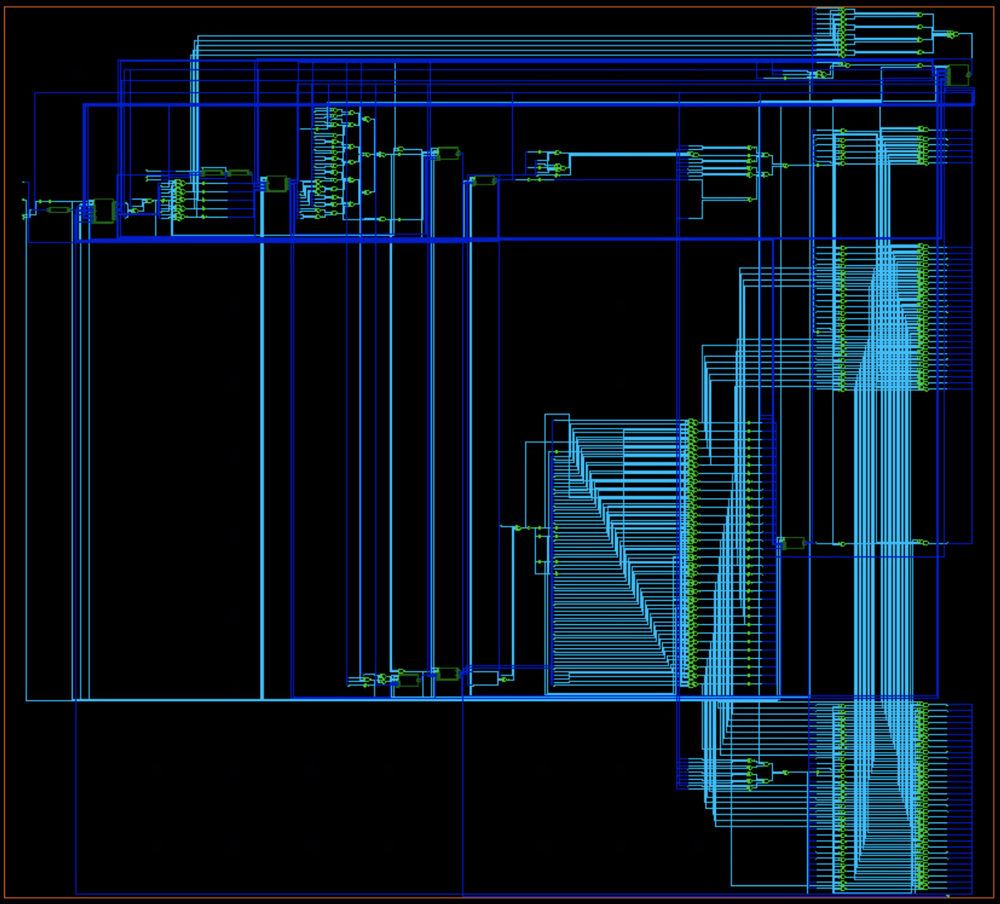
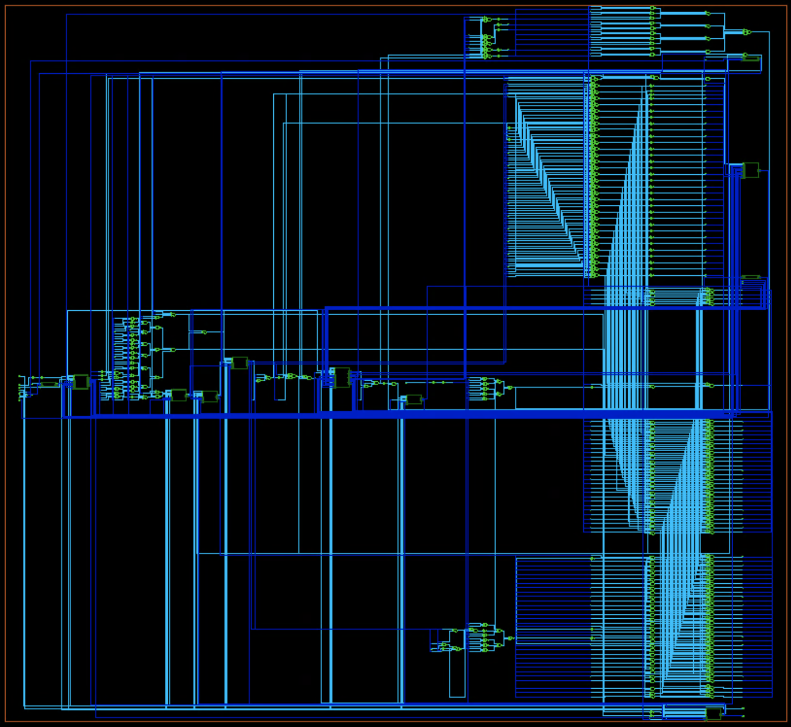
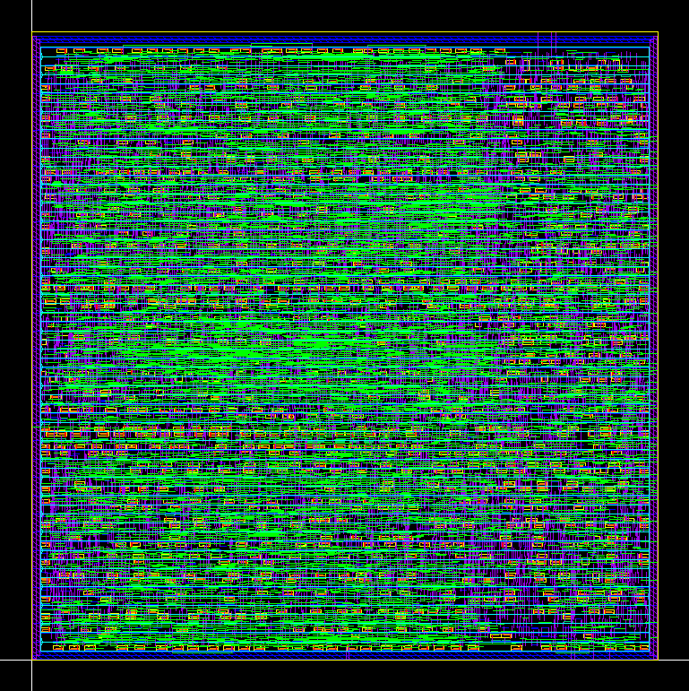
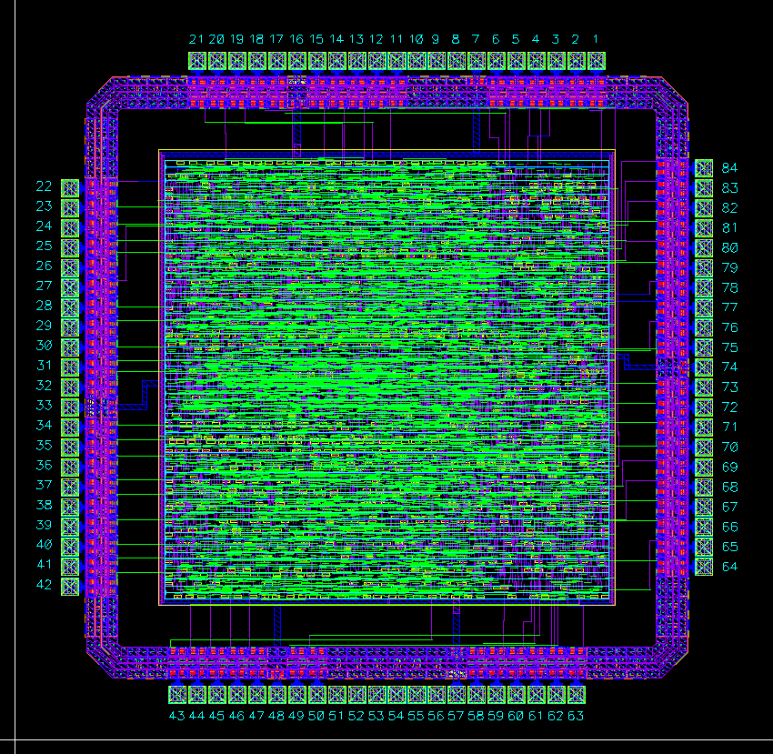
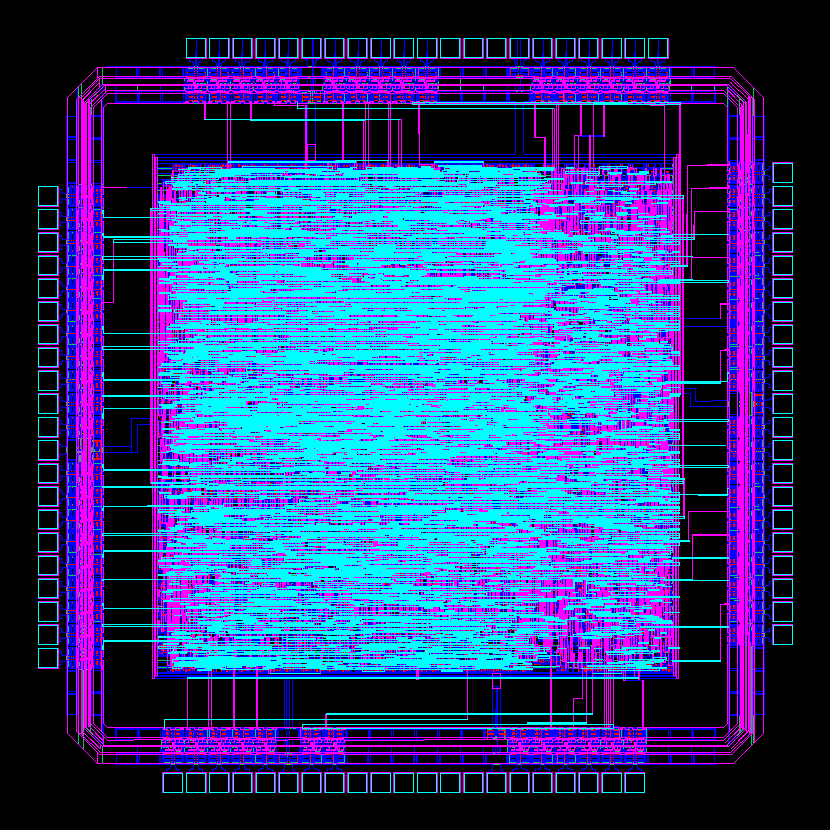

# **MIPS32 Pipeline CPU Chip Design**
* **Description**: MIPS32 CPU chip design with pipeline structure.  
* **HDL Language**: Verilog  
* **Technology**: AMI 0.5
* **Clock Frequency**: 50MHz
* **Design Tools**: Synopsys Design Compiler, Cadence Innovus, Cadence Virtuoso, Cadence NCSim.
***  
## **RTL Design**  
Design is based on the RTL design and simulation result of [A_Pipeline_MIPS_CPU_RTL](https://github.com/YihuiCalm/A_Pipeline_MIPS_CPU_RTL).  
## **Synthesis**
Use Synopsys Design Compiler to synthesize the design with OSU05_stdcell library.  
* Synthesized schematic:   
* [Synthesized timing report](reports/MIPS32_CPU_top_syn.timing)
* [Synthesized cell report](reports/MIPS32_CPU_top_syn.design)  
* [Synthesized area report](reports/MIPS32_CPU_top_syn.area)  
* [Synthesized power report](reports/MIPS32_CPU_top_syn.pow)
## **DFT**
Insert scan-chain to synthesized netlist using Design Compiler and generate ATPG using TetraMax.  
* Schematic with scan-chain inserted: 
* [Cell report with scan-chain inserted](reports/MIPS32_CPU_top_scan.cell)
* [Simulation result with ATPG](work/sim/MIPS32_CPU_top_scan_tb.db/)
## **Place & Route**
Use Cadence Innovus to place and route the circuit, and fit it in a padframe and check design using Cadence Virtuoso.
* Post-route layout: 
* [Post-route summary report](reports/postroute.rpt)  
* [Post-route timing report](reports/postRoute_timing.rpt)
* [Post-route power report](reports/post_route_power.rpt)
* [Reordered scan-chain report](reports/reordered_scanChain.rpt)
* Whole CPU chip layout: 
* Whole CPU chip extract view: 
* LVS result:
  ```
    Compiling Diva LVS rules...

        Net-list summary for /home/ead/yihui/cadence/LVS/layout/netlist
        count
            30005           nets
            0               terminals
            30295           pmos
            30283           nmos

        Net-list summary for /home/ead/yihui/cadence/LVS/schematic/netlist
        count
            30005           nets
            71              terminals
            27115           pmos
            27115           nmos

    Devices in the rules but not in the netlist:
            cap nfet pfet nmos4 pmos4

    The net-lists match.
  ```


